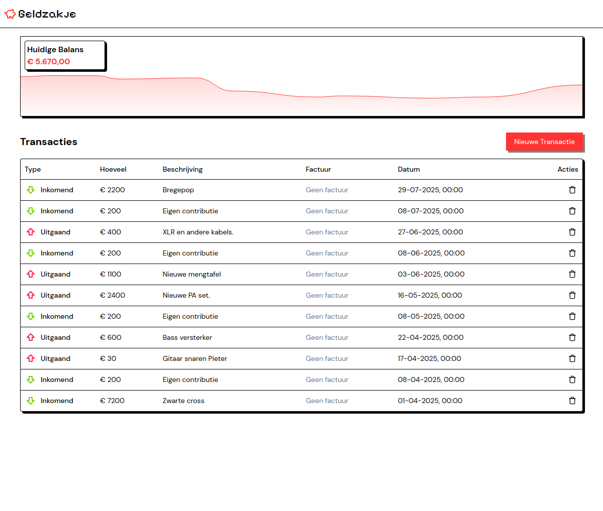

# 💰 Geldzakje



Een eenvoudige web-applicatie om de financiën van mijn lokale bandje bij te houden. Houd inkomsten en uitgaven bij, upload facturen en krijg inzicht in de financiële status van mijn band.

## ✨ Functies

- 📊 **Transacties bijhouden**: Voeg inkomende en uitgaande transacties toe
- 📅 **Datum selectie**: Kies de exacte datum van elke transactie
- 📄 **Factuur upload**: Upload PDF facturen bij je transacties
- 🎨 **Moderne UI**: Gebouwd met SvelteKit en shadcn/ui componenten
- 🗄️ **Lokale database**: SQLite database voor je privacy
- 🐳 **Docker support**: Eenvoudig te deployen met Docker

## 🚀 Aan de slag

### Vereisten

- Node.js 20+ 
- pnpm (aanbevolen) of npm

### Lokale ontwikkeling

1. **Clone het project**
   ```bash
   git clone <repository-url>
   cd Geldzakje
   ```

2. **Installeer dependencies**
   ```bash
   pnpm install
   ```

3. **Database opzetten**
   ```bash
   pnpm run db:push
   ```

4. **Start de development server**
   ```bash
   pnpm run dev
   
   # Of open direct in browser
   pnpm run dev -- --open
   ```

5. **Open je browser** op `http://localhost:5173`

### Docker deployment

1. **Build en start met Docker Compose**
   ```bash
   docker-compose up -d
   ```

2. **Of handmatig bouwen**
   ```bash
   docker build -t geldzakje .
   docker run -p 3000:3000 -v ./data:/app/prisma geldzakje
   ```

## 💡 Hoe te gebruiken

### Transactie toevoegen
1. Klik op "Nieuwe Transactie"
2. Kies het type (Inkomend/Uitgaand)
3. Voer het bedrag in
4. Selecteer de datum
5. Voeg een omschrijving toe
6. Upload eventueel een factuur (PDF)
7. Klik "Create"

### Transactie verwijderen
1. Vind de transactie in de lijst
2. Klik op de verwijder knop (🗑️)
3. Bevestig de verwijdering

## 🛠️ Technologie

- **Frontend**: SvelteKit met Svelte 5
- **Database**: SQLite met Prisma ORM
- **UI**: shadcn/ui componenten
- **Styling**: Tailwind CSS
- **Validatie**: Zod met sveltekit-superforms
- **File Storage**: Google Cloud Storage (GCP) voor PDF facturen
- **Deployment**: Docker

> **⚠️ Disclaimer PDF Storage**: De applicatie gebruikt momenteel Google Cloud Storage (GCP) voor het opslaan van PDF facturen. Deze implementatie kan eenvoudig worden uitgewisseld voor andere object storage providers zoals AWS S3, Azure Blob Storage, of lokale file storage, afhankelijk van je voorkeuren en infrastructuur.

## 📝 Database scripts

```bash
# Database migratie (development)
pnpm run db:migrate:dev

# Database push (development) 
pnpm run db:push

# Database migratie (productie)
pnpm run db:migrate:deploy

# Prisma client genereren
pnpm run db:generate

# Prisma Studio (database viewer)
pnpm run db:studio
```

## 🏗️ Build voor productie

```bash
# Build de applicatie
pnpm run build

# Preview de productie build
pnpm run preview

# Start productie server (met database migratie)
pnpm run start:prod
```

## 📂 Project structuur

```
src/
├── routes/                 # SvelteKit routes
│   ├── +page.svelte       # Hoofdpagina
│   ├── +page.server.ts    # Server-side logica
│   └── components/        # Form componenten
├── lib/                   # Gedeelde bibliotheek
│   ├── components/ui/     # UI componenten
│   └── prisma/           # Database client
└── prisma/               # Database schema & migraties
```

## 🤝 Bijdragen

Suggesties en verbeteringen zijn welkom! Open een issue of maak een pull request.

## 📄 Licentie

Dit project is beschikbaar onder de MIT licentie.
